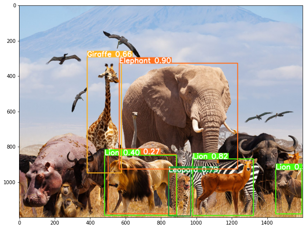

# Wildlife Inference using Ultralytics Yolo aka YOLOv5

## Table of Content
  * [Demo](#demo)
  * [Overview](#overview)
  * [Motivation](#motivation)
  * [Technical Aspect](#technical-aspect)
  * [Environment Setup and Model Training](#Environment-Setup-and-Model-Training)
  * [Using Python Notebook](#Using-Python-Notebook)
  * [Technology Used](#technology-used)
  * [References](#references)
  * [Authors](#authors)
  * [Contact](#contact)
  * [To Do List](#to-do-list)
  
## Demo

### Wildlife Detection Youtube Link:
[](http://www.youtube.com/watch?v=PdNVwNN42mQ "Wildlife Inference/OD (Youtube Link)")



## Overview
This prototype is aimed at trying out Ultralytics Yolo aka YOLOv5 

For this purpose, about 250 wild animal images are used as training and validation dataset.
They belong to 13 different classes. Background images with no class are added to reduce FP.
Inference is made on a seperate image of a group of wild animals and a youtube video of several wild animals in action! 

**Animal classes used:** (Only these classes will be inferred in image/video)</br>
Deer, Alligator, Elephant, Giraffe, Monkey, Lion, Hippo, Zebra, Leopard, Buffalo, Meerkat, Snake and Frog. 

**Training Details:**</br>
The model was trained on Google Colab Pro with Tesla P100 GPU consisting 16GB RAM.
Training was done for 300 epoch with image resolution 640 and batch size 16 using pretrained weights of yolov5s. Custom model has given a mAP of 0.61 after 300 epochs.

*Please refere the folder 'colab_notebooks' for ipynb executed on colab*

## Motivation
Object detection in Computer Vision has its use in several areas of work in the industry.
This project is an attempt to understand YOLOv5 implemenation and improve its performance with hyper parameter tuning to get the best possible results.

## Technical Aspect 
1. Image annotation is done using labelimg in YOLO file format
2. Ultralytics Yolo aka YOLOv5 model was used as Object detection model
3. Model training done on Google Colab Pro on TESLA P 100 GPU with 16GB RAM
4. It took about 1.5hr to train the model with 250 images, 13 classes for 300 epoch at a batch size of 16 and img size of 640.

## Environment Setup and Model Training

To execute this project, please follow the below steps in the same order 

create conda environment
```bash
  conda create -n <envname> python=3.6 -y
```
activate the conda environment
```bash
  conda activate <envname>
```
install ipykernel 
```bash
  pip install ipykernel
```
activate ipykernel on our environment
```bash
  python -m ipykernel install --user --name=<envname>
```
install juypter notebook 
```bash
  pip install jupyter notebook
```

clone this repo to your local machine and open 'Wildlife Inference.ipynb' from jupyter notebook
or import the repo and ipynb from google colab (colab pro recommended)
```http
    https://github.com/MansoorAB/YOLOv5_Wildlife_Inference
```

The data for this project is present in the below Google drive link
```http
    https://drive.google.com/drive/folders/1fnBsL3QJRFA9wayNzKKPEqantv01NcwV
```

## Using Python Notebook:
The ipynb contains detailed information about the execution steps. 
A brief overview about each section in the notebook is presented here.

Section 1 - System Info Check:
1. checks local/colab system configuration
2. clones the ultralytics aka YOLO v5 repo
3. install project dependencies
4. defines local variables and creates folders as needed

Section 2 - Data Setup Local: 
Run a thru g for local machine execution only
1. renames the data/images files in serial order for easy reference
2. do manual annotation in YOLO format with labelimg
3. manually moves files from data/images to data/images/train and data/images/validation
4. run this to move the label files for data/images/train to data/labels/train and data/images/validation to data/labels/validation

Section 3 - Data Setup Colab:
1. zip local folders and manually update to colab space (or)
2. keep data folder on google drive and copy to colab space
3. vefify the contents of data/images and data/labels folders to make sure things are copied correctly

Section 4: 
Steps for loading torchhub model and inferencing on an image

Section 5: 
Preparing custom images using webcam

Section 6 - Custom training:
1. copies yaml file GD to colab space (change .yaml according to your data)
2. step to copy past weights(optional - if using, make sure to keep in GD under weights folder)
3. step to start the model training (change parameters as per your need or run with default)
4. zip the contents of colab space to manually export to local machine

Section 7 - Using Custom trained model from Section 6:
1. Load the custom model from colab space or saved location on local machine 
2. Inference on an image and saving as .png
3. Inference on a recorded video and saving output video as .mp4

## Technology Used
<p align="left">

<a href="https://www.python.org" target="_blank"> 
 </a>

<a href="https://pytorch.org/" target="_blank"> 
 </a>

<a href="https://opencv.org/" target="_blank"> 
 </a>

</p>

## References

- [ultralytics/yolov5](https://github.com/ultralytics/yolov5)
- [Nicholas Renotte](https://youtu.be/tFNJGim3FXw)
- [Tzutalin for labelimg](https://github.com/tzutalin/labelImg)
- [Lion Mountain TV YouTube Channel for inference input video](https://www.youtube.com/watch?v=9jZH_5ZBuQQ)

## Authors

- [@Mansoor Baig](https://github.com/MansoorAB)

## Contact

- For any queries/suggestions please feel free to reach me at *baig.mansoorali@gmail.com*

## To Do List

- Hyper parameter tuning to improve model performance
- performance check on other YOLOv5 variants like yolov5m, yolov5l


  